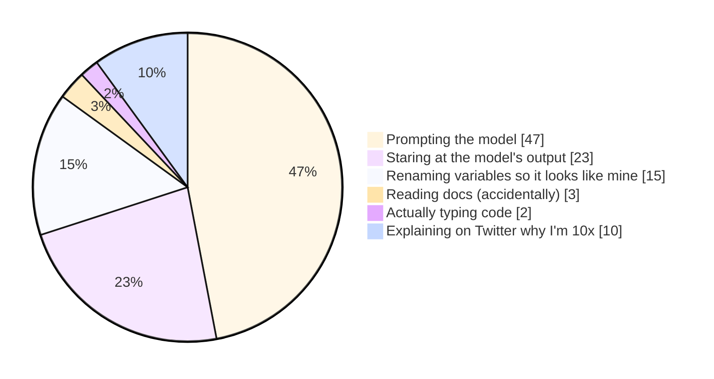
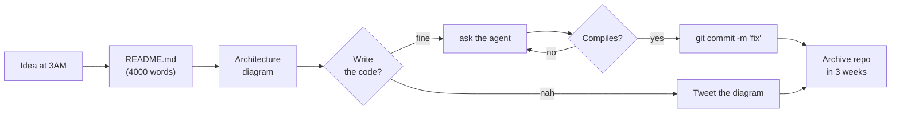

<div align="center">

<a href="https://github.com/rootaccesser">
  
</a>

<h3>RootAccess</h3>
<p><i>Los Angeles* &nbsp;·&nbsp; Java &amp; Spring &nbsp;·&nbsp; 7 public repos, 0 stars, infinite confidence</i></p>
<sub>* location is aspirational, like my roadmap</sub>

<br/>


</div>

---

## `$ neofetch`

```console
       .--.          rootaccess@github
      |o_o |         ─────────────────────────────────────────────
      |:_/ |         OS.........: Arch btw (in a VM, on Windows)
     //   \ \        Shell......: zsh + 47 plugins I never configured
    (|     | )       Editor.....: IntelliJ (idle) + agent (working)
   /'\_   _/`\       Uptime.....: 3 years of "currently learning Java"
   \___)=(___/       Stack......: Java · Spring · Ctrl+C · Ctrl+V
                     Packages...: 1 (spring-boot-starter-everything)
                     Memory.....: 15.9GB / 16GB — IntelliJ is indexing
                     Terminal...: iTerm2, purely for the screenshots
                     Theme......: Tokyo Night (my only real skill)
                     WM.........: 4 monitors, 1 unread Jira ticket
```

---

## `$ whoami`

```diff
+ Java / Spring backend guy. This part is actually true.
+ Self-taught, which means I learned everything in the wrong order.
- "Senior" is a vibe, not a title. Please stop asking for years.
! I have never deployed anything that had users. This is on purpose.
# Architecture decisions are made by whichever Medium article loads first.
```

- 🏗️ I build **microservices** for problems a single `if` statement had already solved
- 🧠 My design pattern of choice is **`AbstractSingletonProxyFactoryBean`**, because it sounds expensive
- 🔮 I don't debug. I re-roll the prompt until the stack trace goes away
- 📚 Currently learning: **Java** (est. completion: heat death of the universe)
- 🧯 If it compiles, it ships. If it doesn't compile, it ships to a different branch
- 💬 Ask me about anything — I'll paste your question into a chat window and get back to you in 4 seconds looking very thoughtful

---

## `$ cat ~/how_the_sausage_is_made.md`



<details>
<summary><b>🛠️ My rigorous engineering process (click to expand, it's shorter than you think)</b></summary>

<br/>



</details>

---

## `$ ls -la skills/`

```console
-rwxr-xr-x  larping        senior   9.9M  Sep  8 03:14  linkedin_headline.txt
-rwxr-xr-x  vibecoding     senior   8.4M  Sep  8 03:15  prompt_v37_FINAL_final.md
-rwxr-xr-x  java           junior   2.1M  Aug 12 2022   HelloWorld.java
-rw-r--r--  spring         ???      1.7M  Sep  8 02:58  application.yml
-rw-------  system_design  0        0B    Never         .gitkeep
drwx------  humility       -        -     -             (permission denied)
```

<div align="center">

### Officially licensed technologies™


</div>

---

## `$ git log --oneline`

```console
a1b2c3d  (HEAD -> main) fix
e4f5g6h  fix fix
i7j8k9l  final fix
m0n1o2p  revert "final fix"
q3r4s5t  refactor (deleted the tests)
u6v7w8x  feat: add AI, remove reason
y9z0a1b  wip
c2d3e4f  Initial commit
```

> [!NOTE]
> `wip` has been HEAD on three separate repos since 2023. They're not abandoned, they're **in stealth**.

---

## `$ github --stats --please-be-kind`

<div align="center">


</div>

> [!WARNING]
> Any green square you see is **statistically likely** to be a commit to this README.

---

## `$ cat /var/log/self_awareness.log`

```log
[03:14:02] INFO   Opened IDE.
[03:14:09] INFO   Opened chat window.
[03:14:11] WARN   IDE closed.
[03:41:55] INFO   Shipped 1,400 lines. Read 0.
[03:42:03] ERROR  NullPointerException in code I have never seen before
[03:42:04] INFO   Pasting error into chat window...
[03:42:11] INFO   Fixed! (unclear how)
[04:02:00] INFO   Updated LinkedIn headline to "Building the future of AI"
[04:02:31] WARN   Repo has 0 stars and 1 follower
[04:02:32] INFO   Follower is me on my alt
[04:02:33] FATAL  Moment of clarity. Recovering...
[04:02:34] INFO   Recovered. Starting new project.
```

---

<div align="center">

### 🐍 Watch a snake eat the four commits I made this year


<br/>

**Currently:** pretending `parking-spaces` is a startup &nbsp;·&nbsp; **Learning:** Java (year 4) &nbsp;·&nbsp; **Open to:** Staff+ roles only

<br/>


<sub><i>No engineers were harmed in the making of this profile. No code was written either.</i></sub>

</div>
